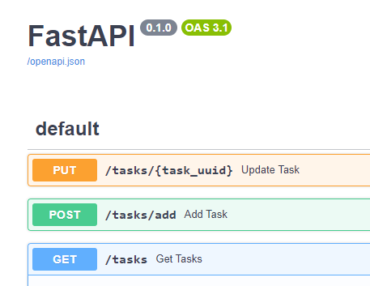

# FastAPI + PostgresQL

[//]: # (## _Solution of a [test task]&#40;https://github.com/alexroot-coder/test_task_django_Ranks/blob/master/Тестовое_задание_для_Python_разработчика.pdf&#41;  for ООО Ранкс_)

## Installation


Step one clone app:
```sh
git clone https://github.com/alexroot-coder/test_task_FastAPI_Estesis.git
```
Step two setup pyvenv and install requirements:
```sh
cd test_task_FastAPI_Estesis
python3 -m venv venv
source venv/bin/activate
pip3 install -r requirements.txt
```
Step three set environment variables by edit your own .env-file:

```sh
POSTGRES_DB=postgres
POSTGRES_USER=postgres
POSTGRES_PASSWORD=postgres
POSTGRES_DB_PORT=5433
POSTGRES_DB_HOST=YOUR_DB_HOST
``` 
Run app using the following command:
```sh
cd test_task_FastAPI_Estesis && uvicorn app.main:app --reload --port 8000
``` 

Verify the deployment by navigating to your server address in your preferred browser.
```sh
127.0.0.1:8000/docs
```

## Run app using Docker

Run a container with app:

```sh
docker-compose -f docker-compose.yaml up -d
```
Verify the deployment by navigating to your server address in your preferred browser.

```sh
127.0.0.1:8000/docs
```
## Usage




## FeedBack

[](https://t.me/yavamnerobot)
[](mailto:alexrozhentsev@gmail.com)


